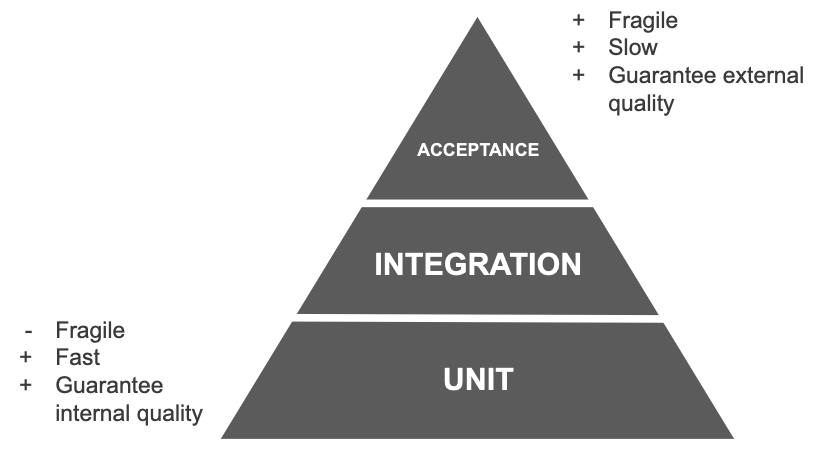
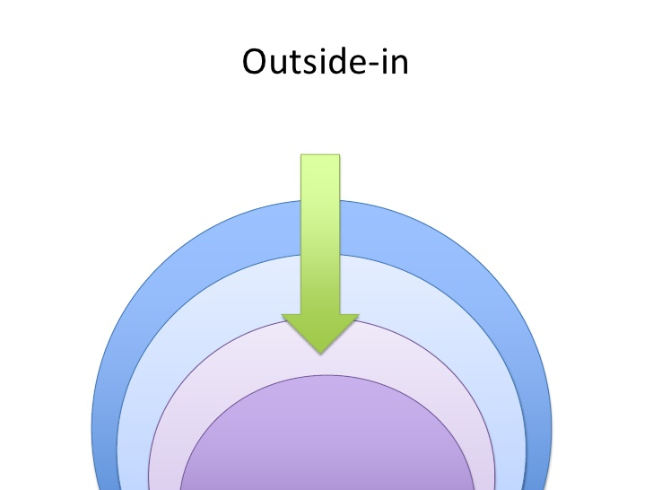
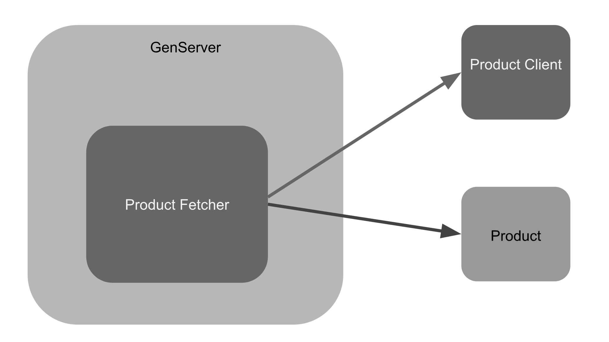
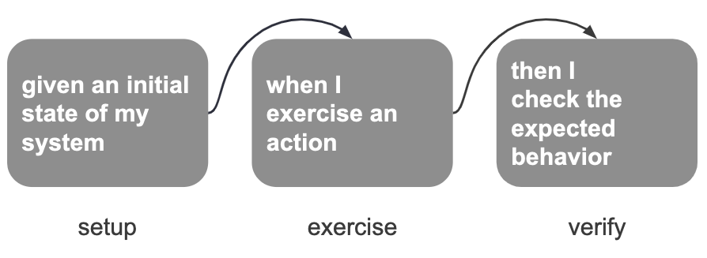
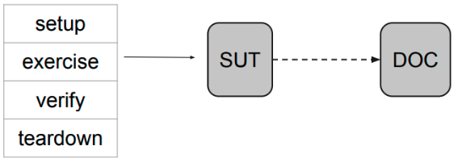
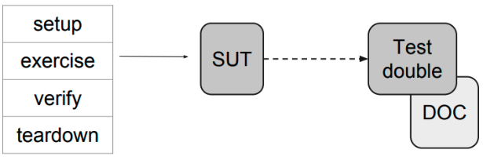

slidenumbers: true

## Testing in an Elixir world
##### *rafaelrochasilva@gmail.com*
##### @RocRafael

---

# **Rafael Rocha**
- Full Stack developer at *Plataformatec / The RealReal*
- Master degree in *Electrical Engineering*
- Bachelor of *Computer Science*
- Father :boy::girl::heart: & Cooker :meat_on_bone::spaghetti:


---
# Agenda

- **Specifications** and software development
- **Base test** concepts
- Testing with **Elixir**

---

## When we start a *user story*, read the description, the acceptance criteria, and *start coding*

---

# *But…* <br>
Are you bringing the *specifications* into code?


---

# Are you confident about your deliverables?


---

# How to bring the **specifications** into code?

---

# Before *answering* those questions we need some *base testing* concepts

---

# Why *testing*?
[x] Be **self-confident**


---

# Why *testing*?
[x] Be **self-confident**
[x] Organize thoghts


---

# Why *testing*?
[x] Be **self-confident**
[x] Organize thoghts
[x] Keep the **costs low**


---
# Why *testing*?
[x] Be **self-confident**
[x] Organize thoghts
[x] Keep the **costs low**
[x] Bring **quality** to the code


---

# What are the types of tests?

---

# Acceptance:
- Expressed as a usage scenario.
- End to end
- Close to the UI


---

# Integration:
- Test between acceptance and unit
- Test the behavior of 2 or more entities


---

# Unit:
- Tests the behavior of 1 entity


---

# Test pyramid



---

## Falar da app que vamos criar
## Lets practice MUDAR?

As a User, I want to fetch products from abcprincing.com so that we can store the current name and price of a given product in memory.

---

## Acceptance Criteria:
- All *products name* and *price* should be fetched and stored in memory.
- The product name should be *capitalized*

---

## Basically what we have to do:

1) *Fetch Products* from the API
2) Build a *structure* with id, capitalize name and price
3) Consume the data *in memory*

---

# Let's use an Outside-in approach


---

## To *keep* the data *in memory* we will use *Genserver*.

---

## What is a Genserver?


“A GenServer is a process like any other Elixir process and it can be used to keep state, execute code asynchronously and so on."
-- Elixir Documentation

---

```elixir
defmodule GreenBox.PriceUpdater do
  use GenServer
  @time_to_consume 10000

  def start_link do
    GenServer.start_link(__MODULE__, [])
  end

  def init(_) do
    state = build_products()
    schedule_work()
    {:ok, state}
  end

  def list_products(pid) do
    GenServer.call(pid, :list_products)
  end
```

---

```elixir
  @doc """
  Run the job and reschedule it to run again after some time.
  """
  def handle_info(:get_products, _state) do
    products = build_products()

    schedule_work()
    {:noreply, products}
  end

  def handle_call(:list_products, _, state) do
    {:reply, state, state}
  end

  defp schedule_work() do
    Process.send_after(self(), :get_products, @time_to_consume)
  end
```

---

```elixir
 defp build_products() do
    fetch_products()
    |> proccess_products
  end

  defp fetch_products do
    response = HTTPoison.get!("http://abcproducts.com/products")
    Poison.decode!(response.body)
  end
```

---

```elixir
  defp proccess_products(products) do
    Enum.map(products, fn %{id: id, name: name, price: price} ->
      new_name = name |> String.downcase() |> String.capitalize()
      new_price = "$#{price/100}"
      %{
        id: id,
        name: new_name,
        price: new_price
      }
    end)
  end
end
```

---

# How can I test GenServer?

---

# Be careful to *not test* your servers through the *callbacks* <br> other wise you are going to test the GenServer implementation.

---

# What should I do? <br> Should I avoid creating tests?

---

# Listen to your code and Change your Design!

---



---

# That been said, lets refactory our code <br> and *let the tests guide us*

---

# But before start doing the test <br> I want to share some really *valuable concepts* about Test

---

# Clarity

A test is __easy__ to understand when we can see the __cause and consequence__ between the __phases__ of the test.

---



---

# Let's see *how it* will *work* for our example

---

## Extract GenServer code to a new entity

```elixir
# Move this code to a new entity
 defp build_products() do
    fetch_products() |> proccess_products()
  end

  defp proccess_products(products) do
    Enum.map(products, fn %{id: id, name: name, price: price} ->
      new_name = name |> String.downcase() |> String.capitalize()
      new_price = "$#{price/100}"
      %{
        id: id,
        name: new_name,
        price: new_price
      }
    end)
  end
```

---

```elixir
# Move this code to a new entity
  defp fetch_products do
    response = HTTPoison.get!("http://abcproducts.com/products")
    Poison.decode!(response.body)
  end
end
```

---

#### Let tests guide the development

[.code-highlight: 5-14]
```elixir
defmodule Greenbox.ProductFetcherTest do
  use ExUnit.Case, async: true
  alias Greenbox.ProductFetcher

  # Specifications into code
  describe "Given a request to fetch a list of products" do
    test "builds a list of products with id, capitalized name and price in dollar" do
      products = ProductFetcher.build()

      assert [
        %{id: "1234", name: "Blue ocean cream", price: _},
        %{id: "1235", name: "Sea soap", price: _}
      ] = products
    end
```

---

```elixir
    test "builds a product with the price with dollar sign" do
      product =
        ProductFetcher.build()
        |> List.first()

      assert Regex.match?(~r/\$\d+\.\d+/, product.price)
    end
  end
end
```

---

#### Product Fetcher - A new entity

[.code-highlight: 2, 7, 12, 16, 17]
```elixir
defmodule Greenbox.ProductFetcher do
  def build() do
    fetch_products()
    |> proccess_products()
  end

  defp fetch_products do
    response = HTTPoison.get!("http://abcproducts.com/products")
    Poison.decode!(response.body)
  end

  defp proccess_products(products) do
    Enum.map(products, fn %{id: id, name: name, price: price} ->
      %{
        id: id,
        name: capitalize_name(name),
        price: price_to_money(price)
      }
    end)
  end
```

---

#### Listen to your code...

```elixir
  defp price_to_money(price) do
    "$#{price / 100}"
  end

  defp capitalize_name(name) do
    name
    |> String.downcase()
    |> String.capitalize()
  end
end
```

---

#### Build an entity to handle product structure

[.code-highlight: 5-15]
```elixir
defmodule Greenbox.ProductTest do
  use ExUnit.Case, async: true
  alias Greenbox.Product

  describe "Given a product" do
    test "transforms its name by capitalizing it" do
      # Setup
      product_name = "BLUE SOAP"

      # Exercise
      expected_product_name = Product.capitalize_name(product_name)

      # Verify
      assert expected_product_name == "Blue soap"
    end
```

---

```elixir
    test "transforms the price in cents to dollar" do
      # Setup
      product_price_in_cents = 1253

      # Exercise
      expected_product_name = Product.price_to_money(product_price_in_cents)

      # Verify
      assert expected_product_name == "$12.53"
    end
  end
end
```

---

#### Product Entity

```elixir
defmodule Greenbox.Product do
  defstruct [:id, :name, :price]

  def price_to_money(price) do
    "$#{price / 100}"
  end

  def capitalize_name(name) do
    name
    |> String.downcase()
    |> String.capitalize()
  end
end
```

---


---

## Did you notice that we are *hitting the Api* every time we run our tests?

---

## Find another way to test the ProductFetcher.

---

# Test Double, how to stub in Elixir?

---

# SUT and collaborator (DOC)
SUT: System Under Test
DOC: Collaborator



---

# Test Double
Is the object that substitutes the real DOC



---

# Let's start by creating a fake client

---

## Fake client

```elixir
# test/support/fake_client.ex
defmodule Greenbox.FakeClient do

  def fetch_products do
    [
      %{id: "1234", name: "BLUE OCEAN CREAM", price: Enum.random(8000..10000)},
      %{id: "1235", name: "SEA SOAP", price: Enum.random(5000..60000)}
    ]
  end
end
```

---
## Configure the Fake Client
[.code-highlight: 9, 15-17]

```elixir
defmodule Greenbox.MixProject do
  use Mix.Project

  def project do
    [
      app: :greenbox,
      version: "0.1.0",
      elixir: "~> 1.7",
      elixirc_paths: elixirc_paths(Mix.env()),
      start_permanent: Mix.env() == :prod,
      deps: deps()
    ]
  end

  # Specifies which paths to compile per environment.
  defp elixirc_paths(:test), do: ["lib", "test/support"]
  defp elixirc_paths(_), do: ["lib"]
end
```

---

```elixir
# config/test.exs

config :greenbox,
  abc_products_client: Greenbox.FakeClient

# config/config.exs
config :greenbox,
  abc_products_client: Greenbox.ProductClient
```

---

## The Real Model that will do the call to the external API

```elixir
defmodule Greenbox.ProductClient do
  def fetch_products do
    response = url() |> HTTPoison.get!()
    Poison.decode!(response.body)
  end

  defp url do
    Application.get_env(:greenbox, :abc_products_url)
  end
end
```
---

## OR Stub requests with libraries
- Bypass (https://github.com/PSPDFKit-labs/bypass)
- Mox (https://github.com/plataformatec/mox)

---

## What about Doctest?
## Are they supposed to substitute tests?

---
[.code-highlight: 4-9]
```elixir
defmodule Greenbox.Product do
  defstruct [:id, :name, :price]

  @doc """
  Converts price in cents to a string money format.
  ## Example:
    iex> Greenbox.Product.price_to_money(1245)
    "$12.45"
  """
  def price_to_money(price) do
    "$#{price / 100}"
  end
```

---

## How tests can reflect *specifications* and help us to build *confident code*?

---

## Conclusion

- Write clear *test descriptions*, the follows the specification
- Always start *outside-in*
- Think in the Test *Pyramid*
- Use *stubs* or build fake clients
- Don't test behaviors
- *Abstract* your code into Modules and made Unit Tests instead of testing behaviors

---

# Thank you!

https://github.com/rafaelrochasilva/greenbox

---

References:

https://github.com/plataformatec/mox
https://github.com/PSPDFKit-labs/bypass
https://github.com/keathley/wallaby
